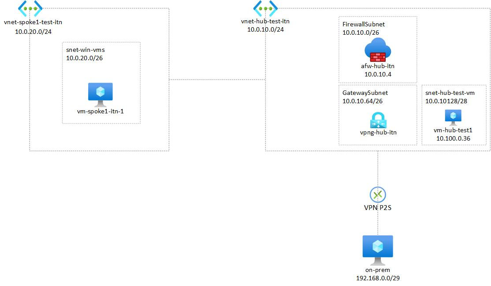

# Hub-Spoke-DeepDive
This repo contains the initial setup required to follow the tutorial on configuring a Hub and Spoke network architecture as illustrated in the figure 1. It includes all necessary resources for deploying virtual networks, virtual machines, firewalls, and VPN gateways on Azure. Additionally, the repository provides step-by-step instructions for deploying additional resources to configure routes, peerings between networks, and firewall rules, ensuring a fully functional Hub and Spoke configuration.

*Figure 1: Hub and Spoke Network Architecture*

## Deploy
